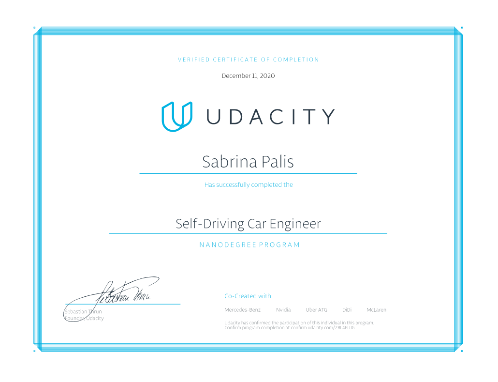

<div align="center">

# 🚗 Self-Driving Car Engineer Nanodegree Projects

### Autonomous Systems • Robotics • Computer Vision • Deep Learning


</div>

---

<div align="center">

<!-- Replace with your own certificate image -->



</div>

---

## Overview

After completing the Deep Learning and Deep Reinforcement Learning Nanodegrees, I pursued the **Self-Driving Car Engineer Nanodegree** through Udacity.

This program provided practical experience across the complete autonomous driving stack, including:

- Computer Vision
- Deep Learning
- Sensor Fusion
- Localization
- Path Planning
- Vehicle Control

The projects collected here were originally completed as part of the program and have been recovered, modernized, and documented as standalone repositories.

Together they provide a practical journey through the major engineering components required for autonomous navigation.

---

## Autonomous Driving Stack

```text
Perception
├── Finding Lane Lines
├── Advanced Lane Finding
├── Traffic Sign Classifier
└── Behavioral Cloning

Localization
├── Extended Kalman Filter Sensor Fusion
└── Kidnapped Vehicle Localization

Planning
└── Highway Path Planning

Control
└── PID Controller
```

---

# Portfolio Projects

## Perception

### 🚗 Finding Lane Lines

Classical computer vision pipeline for lane boundary detection using OpenCV.

**Skills**

- OpenCV
- Edge Detection
- Hough Transform
- Image Processing

Repository:

https://github.com/MinervaRose/self-driving-car-finding-lane-lines

---

### 🚗 Advanced Lane Finding

Robust lane detection system using camera calibration, perspective transforms, polynomial fitting, and curvature estimation.

**Skills**

- Camera Calibration
- Perspective Transform
- Lane Tracking
- Geometric Computer Vision

Repository:

https://github.com/MinervaRose/self-driving-car-advanced-lane-finding

---

### 🚦 Traffic Sign Classifier

Convolutional Neural Network trained to classify German traffic signs.

**Skills**

- TensorFlow
- CNNs
- Image Classification
- Deep Learning

Repository:

https://github.com/MinervaRose/self-driving-car-traffic-sign-classifier

---

### 🤖 Behavioral Cloning

End-to-end deep learning system capable of predicting steering commands directly from camera images.

**Skills**

- Deep Learning
- Computer Vision
- Autonomous Steering
- NVIDIA Architecture

Repository:

https://github.com/MinervaRose/self-driving-car-behavioral-cloning

---

## Localization

### 📡 Extended Kalman Filter Sensor Fusion

Vehicle tracking system combining radar and lidar measurements through probabilistic state estimation.

**Skills**

- Sensor Fusion
- Extended Kalman Filters
- State Estimation
- Radar & Lidar Processing

Repository:

https://github.com/MinervaRose/self-driving-car-extended-kalman-filter

---

### 📍 Kidnapped Vehicle Localization

Particle Filter implementation for probabilistic localization under uncertainty.

**Skills**

- Particle Filters
- Monte Carlo Localization
- Probabilistic Robotics
- Autonomous Navigation

Repository:

https://github.com/MinervaRose/self-driving-car-kidnapped-vehicle

---

## Planning

### 🛣️ Highway Path Planning

Behavior planning and trajectory generation for autonomous highway driving.

**Skills**

- Path Planning
- Trajectory Generation
- Behavior Planning
- Collision Avoidance

Repository:

https://github.com/MinervaRose/self-driving-car-path-planning

---

## Control

### 🎯 PID Controller

Closed-loop vehicle steering controller using proportional, integral, and derivative feedback.

**Skills**

- PID Control
- Feedback Systems
- Vehicle Dynamics
- Control Theory

Repository:

https://github.com/MinervaRose/self-driving-car-pid-controller

---

## Skills Demonstrated Across the Program

### Perception

- OpenCV
- Computer Vision
- Deep Learning
- Image Classification
- Feature Extraction

### Localization

- Sensor Fusion
- Extended Kalman Filters
- Particle Filters
- State Estimation

### Planning

- Highway Navigation
- Trajectory Generation
- Behavior Planning
- Collision Avoidance

### Control

- PID Controllers
- Feedback Systems
- Vehicle Dynamics

### Software Engineering

- Python
- C++
- Numerical Computing
- Real-Time Systems

---

## Why These Projects Matter

Autonomous vehicles require much more than machine learning.

A complete autonomous driving system combines:

1. Perception of the environment
2. Localization of the vehicle
3. Planning of safe future actions
4. Control of vehicle motion

The projects in this portfolio collectively implement these foundational components and provide hands-on experience with many of the algorithms that underpin modern robotics and autonomous systems.

---

## Looking Back

These projects were originally completed during the Self-Driving Car Engineer Nanodegree and are preserved as historical engineering artifacts.

While modern autonomous systems increasingly incorporate deep learning, foundation models, and large-scale sensor fusion architectures, the concepts explored here remain fundamental to robotics, autonomous vehicles, aerospace systems, and intelligent navigation.

They also represent an important stage in my journey from software development into AI, machine learning, robotics, and autonomous systems engineering.

---

## Related Nanodegree Collections

- Android Basics Nanodegree Projects
- Deep Learning Nanodegree Projects
- Deep Reinforcement Learning Nanodegree Projects

Together these repositories document a multi-year progression through software engineering, deep learning, reinforcement learning, and autonomous systems.

---

<div align="center">

### 🚀 From Perception to Control

**Computer Vision → Localization → Planning → Control**

</div>
